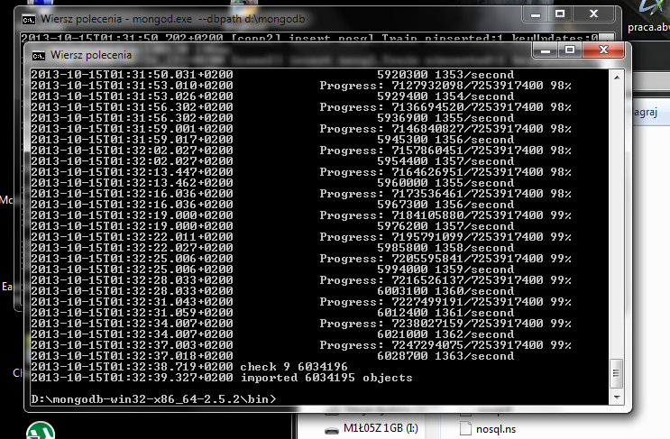
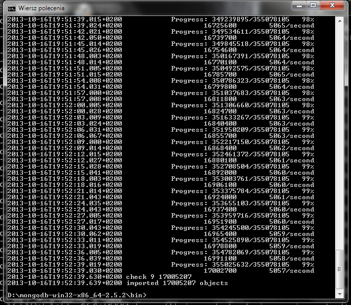

# Zadanie 1
a) Baze Train.csv zaimportowałem do bazy MongoDB poleceniem:

```sh
mongoinport -c nosql -d Train "_id" "title" "body" "tags" --type csv --file d:\Train.csv --headerline
```



b) Zaimportowano 6034195 objektów (patrz screen nr 1) czas trwania ok. 2,5h 


c) Zmieniłem format tagów ze stringa na tablice za pomocą skryptu stringToarray
   czas wykonywania ok. 40min
   
   Zliczyłem tagi za pomocą skryptu countElementsArray czas trwania ok. 30min wynik to 17408733
   
   Zliczyłem unikalne tagi za pomocą skryptu countdiffrentElementsOfarray czas trwania ok. 45min wynik to 36806

d) Zmieniłem baze text8 na text8.json za pomocą programu napisanego w bashu stringTojson który każdę słowo zamieniał na osobny obiekt json trwało to ok. 30min



   Wczytałem baze text8.json do bazy MongoDB (patrz screen nr 2) zaimportowano 17005207 objektów
